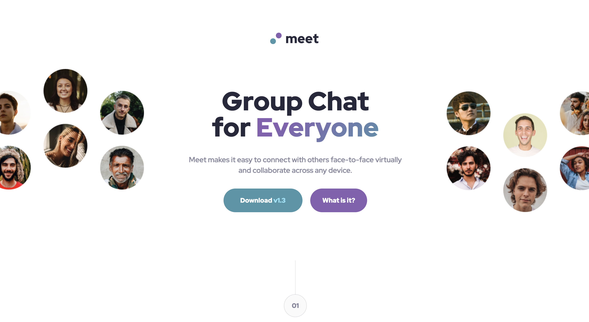

# Frontend Mentor - Meet landing page solution

This is a solution to the [Meet landing page challenge on Frontend Mentor](https://www.frontendmentor.io/challenges/meet-landing-page-rbTDS6OUR). Frontend Mentor challenges help you improve your coding skills by building realistic projects.

## Table of contents

- [Overview](#overview)
  - [The challenge](#the-challenge)
  - [Screenshot](#screenshot)
  - [Links](#links)
- [My process](#my-process)
  - [Built with](#built-with)
  - [What I learned](#what-i-learned)
  - [Continued development](#continued-development)
  - [Useful resources](#useful-resources)
- [Author](#author)
- [Acknowledgments](#acknowledgments)

**Note: Delete this note and update the table of contents based on what sections you keep.**

## Overview

### The challenge

Users should be able to:

- View the optimal layout depending on their device's screen size
- See hover states for interactive elements

### Screenshot




### Links

- Solution URL: [https://www.frontendmentor.io/solutions/meet-landing-page-HXGmoYkc4Q]
- Live Site URL: [https://jocular-tartufo-3969e6.netlify.app/]

## My process

### Built with

- Semantic HTML5 markup
- CSS custom properties
- Flexbox
- CSS Grid
- Mobile-first workflow

### What I learned

Use this section to recap over some of your major learnings while working through this project. Writing these out and providing code samples of areas you want to highlight is a great way to reinforce your own knowledge.

To see how you can add code snippets, see below:

I learned to use the <picture></picture> tag handle multiple images instead of having one image that is scaled up or down based on the viewport width, multiple images can be designed to more nicely fill the browser viewport.

```html
<picture>
  <source media="(min-width: 90rem)" srcset="assets/desktop/image-footer.jpg" />
  
</picture>
```

I added a feel animations to the page to liven it up a little

```css
.bounce-in-top {
  -webkit-animation: bounce-in-top 1.1s both;
  animation: bounce-in-top 1.1s both;
}
```

I learned a little about the matchMedia() method method returns a MediaQueryList with the results from the query.
I used this to add classes to elements only when the viewport was a certain width, i.e 1440px wide.

```js
if (window.matchMedia("(min-width: 1440px)").matches) {
  setTimeout(() => {
    imageHeroLeft.classList.add("slide-in-left");
    imageHeroRight.classList.add("slide-in-right");
  }, 1100);

  setTimeout(() => {
    mainTextContent.classList.add("fade-in-fwd");
  }, 2100);
}
```

### Useful resources

- [https://animista.net/]= - Animista is fantastic for finding pre-wrtten CSS animations

## Author

- Frontend Mentor - [@jake4369](https://www.frontendmentor.io/profile/jake4369)
- Twitter - [@jakexcode](https://www.twitter.com/jakexcode)
